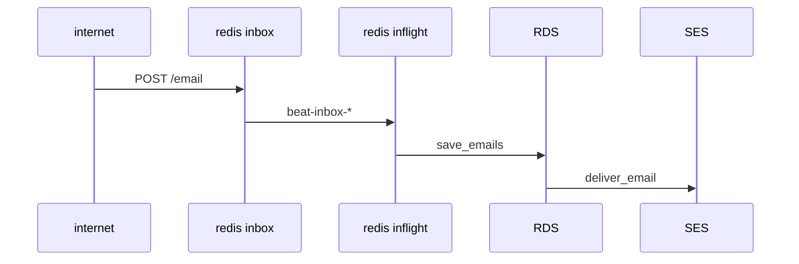
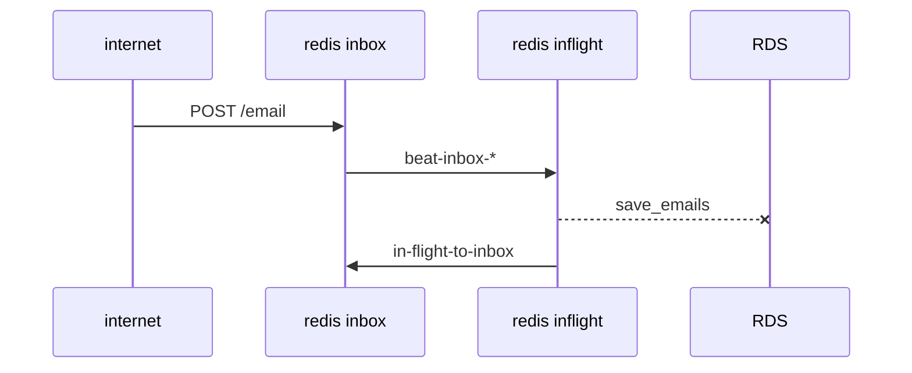
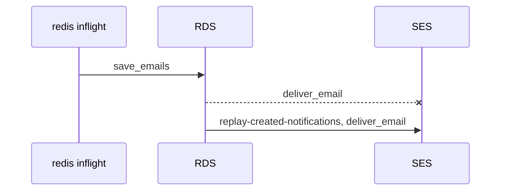
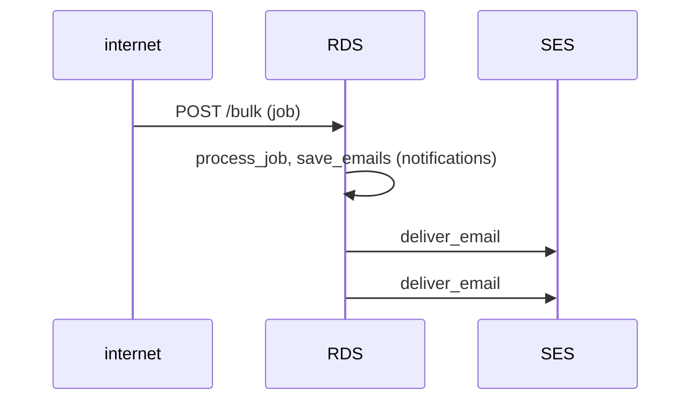
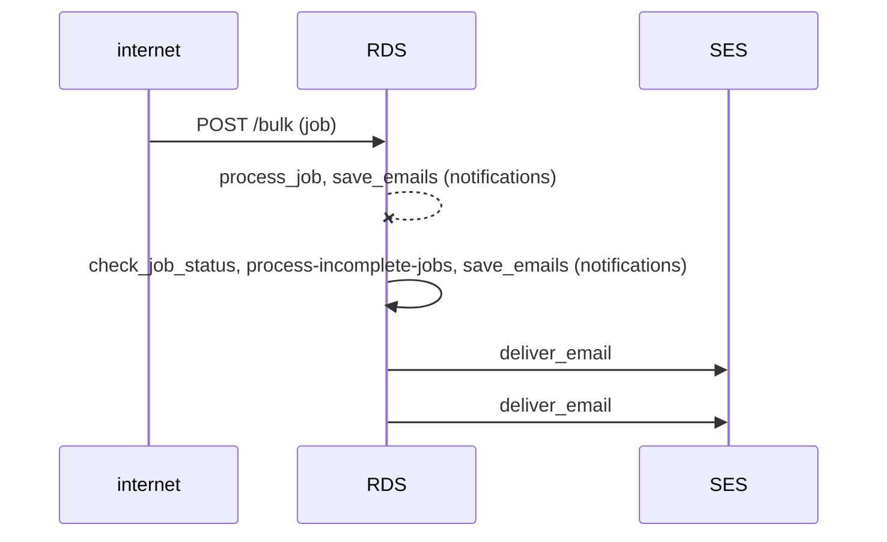
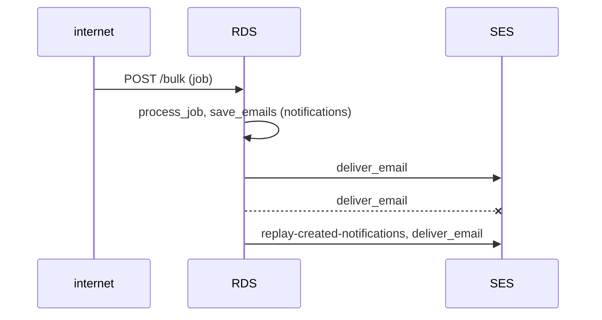

# Data Flow

These diagrams show where the data for our notifications exist and what tasks move it along. Most tasks are run asyncronously by adding to a SQS queue and having our celery workers pick them up. Some tasks (particularly ones handling errors) are scheduled to run at certain intervals.

We assume emails are being sent, but the flows for sms are similar (with "save_smss" replacing "save_emails", and so on).

## POST to /email or /sms

### Happy path

### Error saving to database

### Error sending to SES

## POST to /bulk

### Happy path

### process_job interrupted

### Error sending to SES

