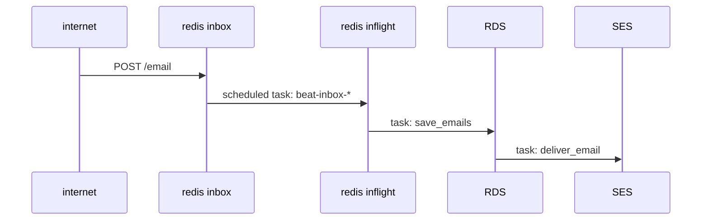
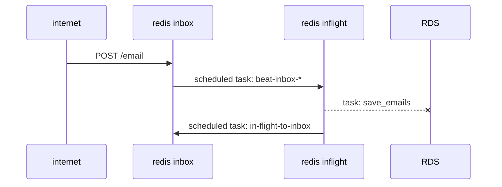
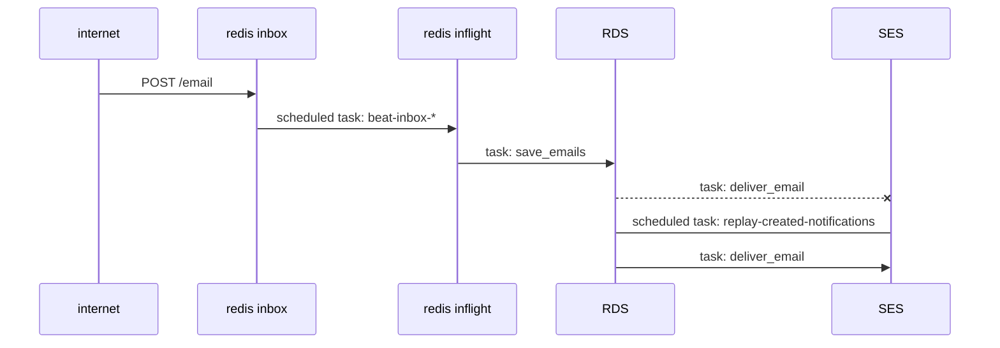

# Data Flow

## POST to /email or /sms

### Happy path

```mermaid
    sequenceDiagram
    
    participant internet
    participant redis inbox
    participant redis inflight
    participant RDS
    participant SES

    internet ->> redis inbox: POST /email
    redis inbox ->> redis inflight: scheduled task: beat-inbox-*
    redis inflight ->> RDS: task: save_emails
    RDS ->> SES: task: deliver_email
```

### Error saving to database

```mermaid
    sequenceDiagram
    
    participant internet
    participant redis inbox
    participant redis inflight
    participant RDS

    internet ->> redis inbox: POST /email
    redis inbox ->> redis inflight: scheduled task: beat-inbox-*
    redis inflight --x RDS: task: save_emails
    
    redis inflight ->> redis inbox: scheduled task: in-flight-to-inbox
```

### Error sending to SES

```mermaid
    sequenceDiagram
    
    participant internet
    participant redis inbox
    participant redis inflight
    participant RDS
    participant SES

    internet ->> redis inbox: POST /email
    redis inbox ->> redis inflight: scheduled task: beat-inbox-*
    redis inflight ->> RDS: task: save_emails
    RDS --x SES: task: deliver_email
    RDS -> SES: scheduled task: replay-created-notifications
        RDS ->> SES: task: deliver_email
```

## POST to /bulk

