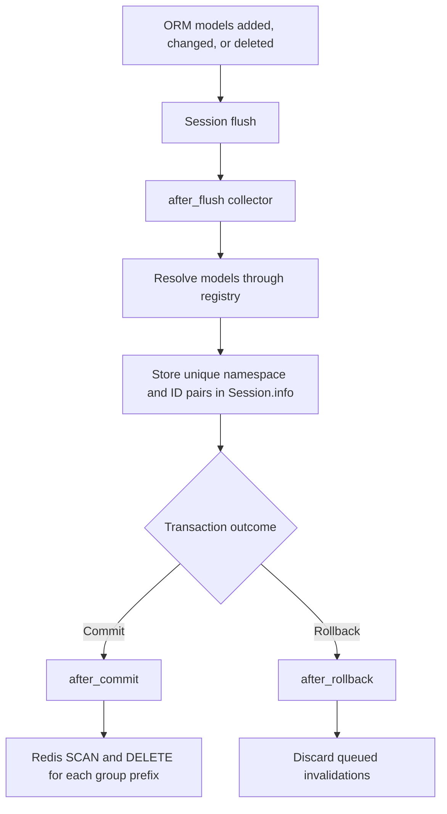

# Dogpile cache architecture

## What Dogpile caching is

[Dogpile Cache](https://dogpilecache.sqlalchemy.org/) is a cache abstraction used
to place the result of an expensive function call in a backend such as Redis.
On the first call, the function runs and its result is cached. Calls with the
same arguments return the cached value until it expires or is invalidated.

Dogpile also coordinates concurrent regeneration. When an entry expires, one
caller acquires a lock and refreshes it instead of allowing many callers to run
the same database query at once. This is the "dogpile effect" the library is
named after.

Caching changes the cost of a read, but it also introduces a consistency
problem: the cache has no inherent knowledge that a database write made its
value stale. Most of the architecture in this document exists to solve that
invalidation problem.

## Why we are implementing it

This work is part of an initiative to improve read performance beyond SQL query
optimization. Query tuning, indexes, and eager loading reduce the cost of each
database read, but frequently requested service, user, and template data still
has to be assembled repeatedly. These payloads can include values from related
tables, so even an optimized request can perform several queries and repeat
serialization work.

A shared Redis cache lets all API workers reuse a previously assembled result.
This reduces database load and response time for read-heavy endpoints. It is not
a replacement for query optimization: the uncached path must remain efficient,
and the database remains the source of truth.

The main design goal is therefore not simply "put DAO results in Redis." It is
to make cached reads easy to add while ensuring every relevant successful write
invalidates the right entries, without spreading bespoke Redis calls throughout
the application.

## Terminology

- **Namespace**: the kind of cached owner, currently `service`, `user`, or
	`template`.
- **Group ID**: the identifier of that owner, such as a service ID.
- **Cache group**: every key beginning with `<namespace>:<group-id>:`. A group
	may contain several functions and argument combinations.
- **Fingerprint**: the deterministic representation of the cached function's
	remaining arguments.
- **Invalidation rule**: a mapping from a changed ORM model to the namespace and
	model attribute identifying the affected cache group.
- **ORM mutation**: adding, changing, or deleting a loaded SQLAlchemy model
	instance through the unit of work.
- **Bulk DML**: an `UPDATE` or `DELETE` statement executed directly, without
	mutating loaded model instances.

## How Dogpile caching works OOTB

Dogpile's `@dogpile_region.cache_on_arguments` decorator wraps DAO functions. It generates a key
from the function and its arguments, asks the configured region for that key,
and follows this flow:

1. Return the cached value on a hit.
2. On a miss, acquire the key's creation lock.
3. Call the wrapped function.
4. Serialize and store its return value with an expiry.
5. Return the value to the caller.

## Our implementation

In our application, we configure one Dogpile region backed by Redis. Distributed
locking is enabled so workers coordinate cache regeneration. The default expiry
is 600 seconds and is configurable with `DOGPILE_CACHE_EXPIRATION`.

By default, argument caching produces an exact key for each invocation. Invalidating
that exact key requires knowing every function's name and every argument combination.
This posed a challenge when designing invalidation strategies. We instead supply our 
own key generator and group keys by their owning entity. (Service, User, Template, etc.)

Rather than the default `@dogpile_region.cache_on_arguments` annotation our DAO functions use a  
`cache_on_arguments` wrapper:

```python
@cache_on_arguments(namespace="user", group_by="user_id")
def dao_get_user_by_id(user_id) -> dict:
		...
```

The wrapper records the group argument and delegates read-through behavior to
Dogpile. The custom key generator then: 
1. Binds positional and keyword arguments to the function signature
2. Applies default values
3. Normalizes UUIDs
4. Serializes other values deterministically. 

A grouped key is formatted like so:
```text
<namespace>:<group-id>:<function-name>:<remaining-argument-fingerprint>
```

For example:

```text
template:7d...:dao_get_template_by_id:service_id=2a...
```

This key structure gives us more options when designing invalidation strategies.
With logical groups we can easily target and invalidate key groups


The group argument is used as the key prefix and all other arguments remain part
of the fingerprint. This distinction is important. A function accepting both
`template_id` and `service_id` does not necessarily have a composite cache
identity. In the case of `get_template_by_id_an_service_id`, the template owns this 
cached value, while `service_id` distinguishes invocations and protects query semantics. 
Invalidating the template prefix removes every variant resulting from parameter fingerpints.

### Value serialization & deserialization
Cache values must be JSON-safe dictionaries / scalar values and cannot be 
SQLAlchemy model instances. ORM instances are session-bound, can lazy-load
relationships, and cannot be safely shared between requests or workers. The dogpile
region serializes values to JSON bytes before writing them to Redis and
deserializes them back into model objects on read.

The implementation deliberately separates two concerns:

1. A cached read declares its namespace and group owner at the function level through the 
cache_on_arguments annotation
1. The invalidation registry declares which model writes can change that
	 owner's serialized data.

This is necessary because a cached payload is not always invalidated only by a
write to the same table.

## The invalidation registry

`CACHE_INVALIDATION_REGISTRY` maps an ORM model to one or more
`CacheInvalidationRule` values. Each rule contains:

- `namespace`: the cache group to invalidate.
- `entity_id_attribute`: the attribute on the changed model containing that
	group's ID.

Examples from the current registry:

```python
ServiceUser: [
	CacheInvalidationRule(namespace="service", entity_id_attribute="service_id"),
	CacheInvalidationRule(namespace="user", entity_id_attribute="user_id"),
]

TemplateRedacted: [
	CacheInvalidationRule(namespace="template", entity_id_attribute="template_id"),
]
```

Changing a `ServiceUser` can change both the service's users and the user's
service memberships, so both groups are invalidated. The entity_ids tell the 
invalidator which existing group contains data made stale by a mutation.

### Why use a registry?

The registry was introduced in response to scaling concerns with
the initial service-only design. Dogpile cannot infer the Notify's entity
relationships or understand which related rows contribute to a serialized
payload. Without a registry, each write path would need custom entity specific cache code. 
The registry centralizes and documents direct, structural dependencies while keeping 
the event machinery generic.

The registry currently covers `Service`, `ServicePermission`, `ServiceUser`,
`User`, `Permission`, `Template`, and `TemplateRedacted`. The collector only
queues work for instances matching those models which have . In the current implementation,
it checks changed instances against each registry entry; the registry is small,
read-only at runtime, and can be indexed by model later if its size makes that
optimization worthwhile.

The registry should not become a hidden domain-logic engine. A direct foreign
key that identifies the cache owner belongs here. Unusual fan-out, domain specific logic,
or dependencies that require additional queries are clearer when
explicitly queued by the business operation that knows which owners are
affected. This is similar to our current approach, where rest endpoints often contain
calls to Redis clients to clear cache key values.

## ORM event-based invalidation

When `FF_USE_DOGPILE_CACHING` is enabled during application startup, listeners
are registered on SQLAlchemy's global `Session` class. Registration is guarded
by a process-local lock and `event.contains` checks, making repeated or concurrent
initialization idempotent within a process. Each worker process registers its
own listeners, while request-scoped sessions keep transaction state separate.

For normal ORM writes, invalidation follows the transaction:



`after_flush` examines `session.new`, `session.dirty`, and `session.deleted`.
Resolved `(namespace, entity_id)` pairs are stored in a set in `Session.info`,
which is transaction-local storage provided by SQLAlchemy. The set deduplicates
cases where several rows or several flushes affect the same group.

Redis deletion waits until `after_commit`. Invalidating during flush or before
commit creates two correctness problems:

- A rollback would evict valid data unnecessarily.
- Another request could repopulate the cache from the old database state before
	the transaction commits, leaving a stale value after the write succeeds.

After a commit, `invalidate_group_keys` scans for
`<namespace>:<entity-id>:*` and deletes matching keys in batches. After a
rollback, the queued set is simply removed. This gives every observed ORM write
the same transaction-aware behavior without requiring each DAO to remember an
invalidation call.

## ORM model events versus bulk DML

SQLAlchemy has two materially different write paths. 

An **ORM unit-of-work mutation** loads or creates model instances and changes them
through the session:

```python
user.name = "New name"
db.session.commit()
```

These instances appear in `session.new`, `session.dirty`, or
`session.deleted`, so `after_flush` can inspect them.

A **bulk DML statement** operates directly on rows:

```python
statement = update(User).where(User.id == user.id).values(name="New name")
db.session.execute(statement)
```

This does not create a changed `User` instance in the unit of work, so the
`after_flush` collector cannot infer the affected ID. Legacy
`Query.update()`/`Query.delete()` calls also do not pass through the modern ORM
execute hook. Loading every affected row solely to generate events would remove
the performance benefit of set-based DML.

The implemented DML design replaces legacy bulk DML statements with modern `Session.execute` statements and adds
explicit metadata to the statement:

```python
statement = delete(Permission).where(Permission.user_id == user.id)
db.session.execute(cache_invalidating_dml(statement, user_id=user.id))
```

`cache_invalidating_dml` places the IDs in SQLAlchemy `execution_options`. This
metadata stays within the Python process, is not SQL, and is not sent to the
database. A `do_orm_execute` listener can then:

1. Ignore non-`UPDATE`/`DELETE` statements.
2. Obtain the mapped model from SQLAlchemy.
3. Read the supplied entity IDs.
4. Validate that every attribute required by that model's registry rules is
	 present.
5. Queue the same deduplicated invalidations used by the ORM path.

The database operation still controls the outcome: commit deletes the groups
and rollback discards them. The IDs are explicit because parsing arbitrary SQL
to determine affected rows would be fragile and potentially
expensive.

### Current bulk-DML limitation


In ther current iteration, developers must annotate every relevant
bulk `UPDATE` or `DELETE`; unannotated DML remains invisible to the invalidation
system. Whilte this adds another thing to remember when writing DML statements, the solution is set and forget, and does not require any additional thought beyond wrapping the statement with `cache_invalidating_dml` and ensuring the appropriate mappings exist in the invalidation registry.

This is by no means final and will likely be iterated on to further reduce friction where possible.

## Cache consistency and failure behavior

This design provides transaction-aware invalidation, not atomic consistency
between PostgreSQL and Redis. The database commit completes before the Redis
scan and delete. A concurrent cache read in that small interval can still see
the old value, and there is no distributed transaction spanning both systems.

Post-commit invalidation is synchronous with `commit()`:

```text
database COMMIT
		-> SQLAlchemy after_commit
		-> Redis SCAN
		-> Redis DELETE
		-> commit() returns
```

This adds latency to writes in exchange for faster repeated reads. If Redis
invalidation fails after the database has committed, the exception is logged
with the namespace and entity ID and is not re-raised: a cache outage must not
turn a successful database transaction into an apparent application failure.
The stale entry can therefore remain until its configured expiry, so cache
errors need operational monitoring.

Prefix invalidation uses Redis `SCAN`, not the blocking `KEYS` command, and
deletes matches in batches. It is intentionally broader than exact-key
deletion, which makes adding another cached function within an existing group
safe without updating every write path.

### Possible solution - Requeue invalidation
To reduce the window of stale data in cache when an invalidation fails. The invalidation 
could be re-queued as a celery task to a new queue with a short retry window <600s. To aid 
in failure observability, new alarms are created to track log ouput when an initial cache 
invalidation failure occurs.

1. Attempt invalidation synchronously as the current implementation does
2. On failure, publish `{namespace, entity_id}` to a low-priority queue
3. Retry with exponential backoff for < 600s
4. Treat "no matching keys" as success

This is relatively safe as the operation only deletes data, duplicate or out of order tasks
cannot restore old values. This would however introduce the risk that delayed tasks delete
freshly populated cache entries causing repeat DB calls, a side effect that conflicts with
the goal of implementing this caching system in the first place. 

## Feature flag behavior

`FF_USE_DOGPILE_CACHING` controls the rollout:

- The Dogpile region is configured during application initialization regardless
	of the flag.
- Cached service, user, and template REST read paths are selected only when the
	flag is enabled.
- ORM invalidation listeners are registered only when the flag is enabled.

This avoids cache invalidation overhead while Dogpile reads are disabled. Tests
that enable the flag after application initialization must register the event
listeners explicitly or construct the application with the flag already set.

#
