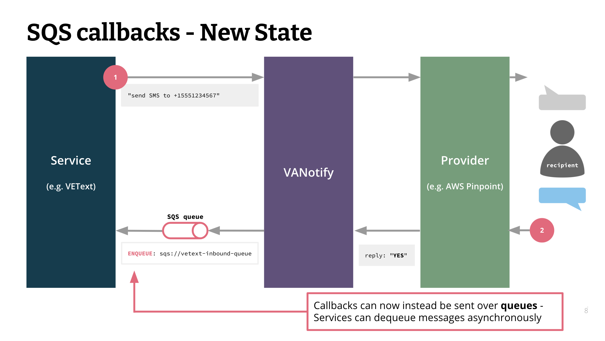

# Callbacks

> [!Note]
> SQS callbacks are not supported at this time, as of 2024. The permissions around setting them up is tricky and makes for a bad experience for our clients.

## Notification Level Callbacks

Clients can send a `callback_url` with their notification request. They will then receive callbacks for notification updates to the specified endpoint.

## Service Level Callbacks

Can configure callbacks to be sent either via queue or webhook.

Callbacks are configured using the endpoints in `app/service/callback_rest.py` and can be configured to send callbacks via either SQS or webhook.

Callback creation can be called using the endpoint POST `/service/<uuid:service_id>/callback`.

Callback updates can be called using POST `/service/<uuid:service_id>/callback/<uuid:callback_id>`.

A callback associated with a service can be retrieved by its id using GET `/service/<uuid:service_id>/callback/<uuid:callback_id>`.

All callbacks associated with a service can be retrieved with GET `/service/<uuid:service_id>/callback/`.

The expected parameters for each of these endpoints is outlined in [OpenAPI documentation](../../documents/openapi/openapi.yaml).

### Assumptions

For callbacks configured to send message via queue, it is assumed that (1) the queue is an AWS SQS queue running on region us-gov-west and (2) that the user running the app has the PLATFORM_ADMIN permission, which allows them to post messages.

For callbacks configured to send via webhook, it is assumed that the user is either a platform admin or has the MANAGE_SETTINGS permission.

### Design

